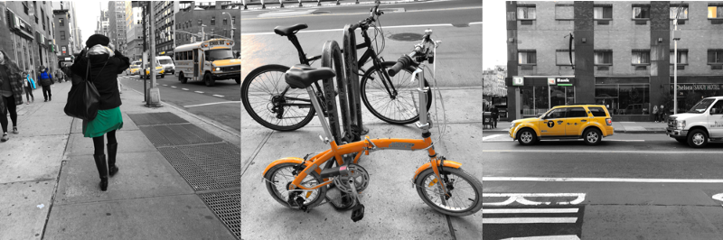

# Wide Color Viewer

This is a test iOS app for identifying wide color in a live camera feed. See [my blog post on wide color in iOS](http://iosoteric.com/adventures-in-wide-color-an-ios-exploration/) for more context.

When you run this app on an iPhone device capable of capturing color in the Display P3 color space -- iPhone 7, 7 Plus, 8, 8 Plus or X -- it will capture a stream of images from the back camera and highlight the regions where color is outside the standard Red Green Blue color space (a/k/a "wide color").

It won't work on the simulator, so run it on a device!

(This hasn't been optimized for performance, but it runs well on an iPhone X!)

